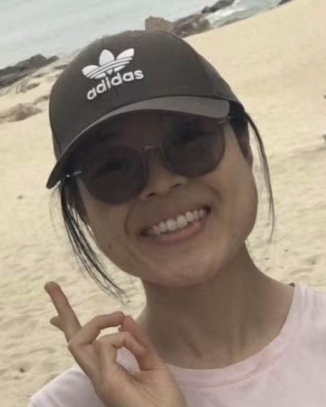

---
# Feel free to add content and custom Front Matter to this file.
# To modify the layout, see https://jekyllrb.com/docs/themes/#overriding-theme-defaults

layout: home
---

I am currently a **Postdoctoral Fellow** in the [Department of Statistics and Actuarial Science](https://saasweb.hku.hk/) at [The University of Hong Kong](https://www.hku.hk/).

My research interests include:

- statistical modeling
- design of computer experiments
- subsampling and large-scale data reduction
- copula modeling and estimation
- variable selection

I am currently on the academic job market and am seeking faculty positions in statistics, data science, industrial engineering and related fields. This is my [CV](Boyang_CV_Mar_2026.pdf).

## Contact

**Office**  
Room 207, Run Run Shaw Building  
[Department of Statistics and Actuarial Science](https://saasweb.hku.hk/)  
[The University of Hong Kong](https://www.hku.hk/)  
Pokfulam, Hong Kong SAR, China  

**Phone:** +852 3917-2466  
**Email:** [byshang@hku.hk](mailto:byshang@hku.hk)  
**Alternate email:** [BoyangS@u.northwestern.edu](mailto:BoyangS@u.northwestern.edu)

